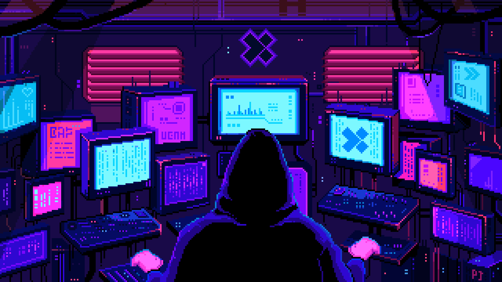

<!-- ================== Typing SVG Banner ================== -->

  

<!-- ================== Main GIF Banner ================== -->

  

<!-- ================== Marquee SVG ================== -->

  

<!-- ================== Profile Views Counter ================== -->

  

<!-- ================== Decorative Divider ================== -->

  

<!-- ================== About Me Section ================== -->

  

<blockquote>
💻 I started my journey in software engineering driven by a curiosity for building efficient and impactful software. Over time, I’ve gained hands-on experience in frontend, backend, and full-stack development, which has strengthened my skills as a problem solver and an adaptable developer. 💡

Currently, I’m focused on low-level programming, working on C and assembly projects 📚, while continuing to explore different frameworks, tools, and technologies. I’m also passionate about contributing to open-source projects and creating meaningful codebases 🚀.

🔭 I’m currently working on:
- C and Assembly projects 💻
- Exploring new systems-level programming concepts ⚙️
- Continuing to build experience across full-stack development 🌐
</blockquote>

<!-- ================== Divider ================== -->

  

<!-- ================== Tech Stack ================== -->

  
  
  

| 🌐 Languages & Frameworks | 🖥️ Tools & Technologies | 🛠️ DevOps & Database |
|---------------------------|------------------------|---------------------|
|      |       |      |

<!-- ================== Divider ================== -->

  

<!-- ================== Decorative SVGs ================== -->

  
  

<!-- ================== GitHub Stats Section ================== -->

  <!-- 📊 GitHub Stats -->
  
  
  <!-- 📊 Streak Stats -->
  

  <!-- 📙 Top Languages -->
  
  
  <!-- ✨ Pinned Repo -->
  

<!-- 🏆 GitHub Trophies -->

  
  
  

<!-- ================== Footer Divider ================== -->

  
   
  

